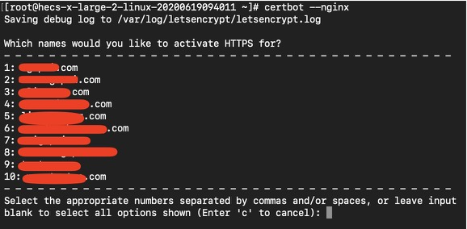
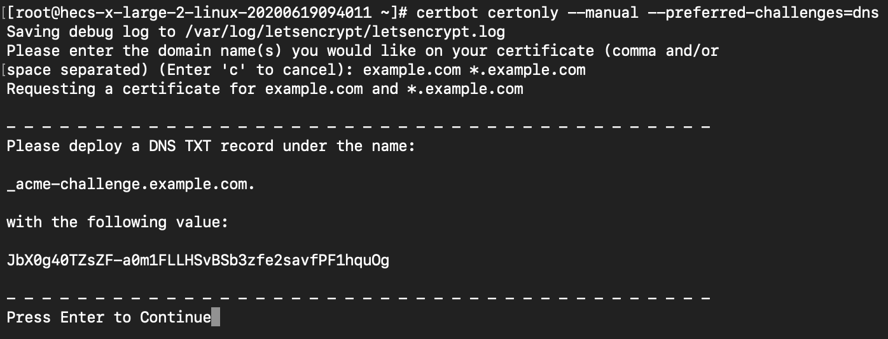

## certbot申请免费的HTTPS证书

#### 环境

- CentOS Linux release 7.9.2009 (Core)
- nginx
- 用户：root
- certbot版本：1.29.0

### 1. 安装 [snapd](https://snapcraft.io/docs/installing-snap-on-centos) 

snap 是一个包管理器，用于下载certbot，这是官方推荐的方式。依次运行一下命令以安装最新的snap。


```sh
yum install epel-release

yum install snapd

systemctl enable --now snapd.socket

ln -s /var/lib/snapd/snap /snap

snap install core

snap refresh core

```

### 2. 安装 certbot

安装完snap后，即可安装cerbot

```sh
snap install --classic certbot

ln -s /snap/bin/certbot /usr/bin/certbot

```

### 3. 申请证书
安装好cerbot后，就可以申请证书了，申请的证书分为**单域名证书**和**通配符证书**。


#### 申请单域名证书

```sh
certbot --nginx
```

运行以上命令后，certbot会检测系统中的nginx配置，并列出可以可申请证书的域名，如下图：



输入对应域名的数字回车后，即可以完成证书申请，并且nginx也会自动配置好！

**注意：nginx里配置的域名必须是可访问的，否则证书会申请失败。**

#### 单域名证书续期

由于certbot申请的证书有效期只有90天，为了保证证书的有效性，因此需要对证书续期。certbot内置了自动续期功能，运行以下命令即可：

```sh
certbot renew --dry-run
```

### 申请通配符证书

申请通配符证书需要通过DNS验证域名的，输入以下命令：

```sh
certbot certonly --manual --preferred-challenges=dns
```

运行以上命令后，输入要申请证书的域名，如果你的域名是example.com, 申请通配符证书则要输入 `example.com *.example.com` ，如下图：



按照提示，此时你需要到你的域名服务商那里部署一个TXT记录，目的是为了验证域名的所有权。TXT记录部署后，回车即可申请到证书。获得证书后，需要在nginx里手动配置导入证书。


以上步骤只是申请到了通配符证书，实际操作中，因为证书是有有效期的，我们需要定期对证书进行续期。虽然可以手动续期，但是实际开发中，我们更希望一切均可自动化，免得因为忘记手动续期而导致证书不可用。

因为certbot并不支持通配符证书自动续期，因此这里推荐一个自动续期通配符证书的脚本[certbot-letencrypt-wildcardcertificates-alydns-au](https://github.com/ywdblog/certbot-letencrypt-wildcardcertificates-alydns-au)，这个脚本其实把申请和续期功能都内置了，上面的教程其实是为了大家明白申请通配符证书的原理和步骤。
