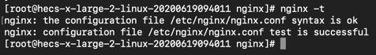

## 前端需要懂的nginx配置

[nginx](https://zh.wikipedia.org/zh-cn/Nginx) 是一个可用于反向代理，负载均衡和http缓存的异步框架的web服务器。

#### 演示环境

- centos 7
- 角色 root
- nginx/1.22.0

## nginx的常用命令

```shell
# 启动nginx
nginx

# 停止nginx 
nginx -s stop

# 测试配置文件是否有效
nginx -t

# 重新加载配置
nginx -s reload
```
***当修改完nginx配置后，一个好的习惯是先运行 `nginx -t` ，测试配置是否有错误，
如无错误再运行 `nginx -s reload`，以免因为配置错误而导致nginx宕机。***

## nginx 的配置文件
nginx默认的配置文件是  `/etc/nginx/nginx.conf` , 正常情况下，这个文件包含以下一条命令：



```shell
include /etc/nginx/conf.d/*.conf;
```

它表示包含 `conf.d/` 目录下的以 `.conf` 为后缀的配置文件。

一个完整的HTTP反向代理配置应该包括http，server和location三个块：

```shell
http { # http服务
  server { # 虚拟主机
    location / { # 访问路径
      listen 80;
      server_name localhost;
    }
  }
}
```

## nginx 的配置项

nginx 的配置项很多，http反向代理的配置项都写在 `http`，`server` 或者 `location` 块里。

## 一个简单的静态服务器配置

```shell
http {
  server {
    listen 80;
    server_name localhost;
    
    root /usr/share/nginx/html;
    
    location / {
      index index.html;
    }
  }
}
```
通过以上配置，当我们访问 `http://localhost:80` 的时候，nginx会返回 `/usr/share/nginx/html/index.html`的内容。

在http里，虚拟主机`server` 可以有多个（理论上可以有无限个）。

虚拟主机 `server` 通过 `listen` 和 `server_name` 配置进行区分，如果有多个 `server` 配置，`listen` + `server_name` 不能重复。

#### 监听服务
使用 `listen` 字段来配置需要监听的服务 ，`listen` 的值 可以配置成 `IP` 或 `端口` 或 `IP:端口` 的形式，以下都是合法的listen配置：

```shell
# 监听端口
listen 8080;

# IP地址(不写端口，默认80)
listen 127.0.0.1;

# IP+端口形式
listen 127.0.0.1:8080;

# 通配符+端口
listen *:8080;

# 本机80端口
listen localhost;

# 本机8080端口
listen localhost:8080;
```

#### 虚拟主机名称配置
使用 `server_name` 支持自定义名称，主机名和域名，同时可以配置多个名称，若配置的是域名，域名还支持泛解析（即通配符模式）：

```shell
# 自定义名称
server_name nginx;

# 主机名
server_name localhost;

# 域名
server_name example.com;

# 通配符域名配置
server_name *.example.com;

# 一个站点配置多个域名，用空格隔开即可
server_name example.com example1.com example2.com;
```

#### location 修饰符

- `=` 精确匹配
- `^~` 前缀匹配
- `~` 正则匹配，区分大小写
- `~*` 正则匹配，不区分大小写

其优先级从高到低分别是：`精确匹配`，`前缀匹配`， `正则匹配`， `不写修饰符`。

```shell
server {
  # 精准匹配 /index 的查询
  location = /index {
    root /usr/share/nginx/html;
    index index.html; 
  }
  
  # 无修饰符，匹配任何请求，因为所有请求都是以/开始
  location / {
    root /usr/share/nginx/html;
    index index.html; 
  }
}
```

#### root和alias的区别
二者都是指定访问的资源路径

- `root` 则是最上层目录的定义。 `alias` 是一个目录别名的定义；
- `root` 字段可以配置在 `http`，`server` 或者 `location` 块中。`alias` 只能写在于 `location` 中；
- `root` 的匹配结果是：root路径+location路径。 `alias` 的匹配结果是：使用alias路径替换location路径；
- `root` 末尾的斜杠`/`可有可无；`alias` 末尾的斜杆必须带上；

```shell
server {
  listen 80;
  server_name example.com
  locatoion /images/ {
    root /www/static;
  }
  
  # 当访问 example.com/static/smile.jpg时
  # nginx 将返回 /www/static/images/smile.jpg的文件资源
}

server {
  listen 80;
  server_name example.com;
  
  locatoion /images/ {
    # 末尾记得加上/
    alias /www/static/;
  }
  
  # 当访问 example.com/static/smile.jpg时
  # nginx 将返回 /www/static/smile.jpg的文件资源
}
```

#### try_files
`try_files` 指令可用于检查指定的文件或目录是否存在；如果不存在，则重定向到指定位置。
这个指令在前端项目中路由使用history模式的时候会非常有用。

```shell
server {
  listen 80;
  server_name example.com;
  
  location / {
    root /www;
    index index.html;
  
    try_files $uri uri/ /index.html;
 }
}
```
假如当访问如果 `www` 目录下没有 `/nothing` 资源， 那么当访问 `example.com/nothing` 时，
nginx将放回 index.html。

#### 反向代理
使用 `proxy_pass` 指令可以使访问请求转发到其他服务。

```shell
server {
  listen 80;
  server_name example.com;
  
  # 匹配 /api/ 的请求将转发到本地3000端口期待的服务
  location ~ /api/ {
    proxy_pass http://localhost:3000;
  }
}
```

这里说一下 `proxy_pass` 配置的末尾加与不加斜杆 `/` 的区别：

##### 不加斜杆/：
```shell
server {
  listen 80;
  server_name example.com;
  
  # 匹配 /api/ 的请求将转发到本地3000端口期待的服务
  location ~ /api/ {
    proxy_pass http://localhost:3000;
  }
  # 此时新的目标url中，匹配的uri部分不做修改，原来是什么就是什么
  # 如访问 http://example.com/api/user 时，将转发到本地服务 http://localhost:3000/api/user
}
```

##### 加斜杆/
```shell
server {
  listen 80;
  server_name example.com;
  
  # 匹配 /api/ 的请求将转发到本地3000端口期待的服务
  location ~ /api/ {
    proxy_pass http://localhost:3000/;
  }
  # 此时新的目标url中，匹配的uri部分将会被修改为该参数中的uri
  # 如访问 http://example.com/api/user 时，将转发到本地服务 http://localhost:3000/user
}
```

#### 缓存
默认情况下，浏览器优先读取缓存，而前端的html文件通常更新频繁，因此需要告诉浏览器不要读取缓存。

```shell
server {
  listen 80;
  server_name example.com;
  
  location / {
    root /www;
    index index.html;
  
    try_files $uri uri/ /index.html;
    
    # html后缀的文件不要设置不要读缓存
    if ($request_filename ~* ^.*?.(html)$) {
       add_header Cache-Control "private, no-store, no-cache, must-revalidate, proxy-revalidate";
    }

  }
  
  location ~ /static/ {   
    # 缓存100后过期
    expires 100d;
  }  
}

```

#### gzip压缩
配置 gzip 压缩可以减少流量损失和减少请求时间。

```shell
http {
  gzip on;
}
```

#### 限制请求体大小
默认情况下，nginx限制的请求体的大小是1M，可以通过 `client_max_body_size` 配置来修改。

```shell
server {
  # 限制请求体大小为100M
  client_max_body_size 100m;
}
```

#### 限制请求方法

```shell
server {
  location /api/ {
      # 只允许GET和POST请求
      if ($request_method !~ ^(GET|POST)$ ) {
        return 405;
      }
  }
}
}
```

#### 开启HTTPS
nginx支持https
```shell
server {
    # https 默认443端口
    listen 443;
    server_name example.com;

    # 开启ssl
    ssl on;

    # 配置nginx ssl证书的路径
    ssl_certificate /etc/nginx/server.crt;
    # 配置nginx ssl证书key的路径
    ssl_certificate_key /etc/nginx/server.key;
    # 指定客户端建立连接时使用的ssl协议版本
    ssl_protocols TLSv1.2 TLSv1.3;
    #指定客户端连接时所使用的加密算法
    ssl_ciphers "ECDHE-ECDSA-AES128-GCM-SHA256:ECDHE-RSA-AES128-GCM-SHA256:ECDHE-ECDSA-AES256-GCM-SHA384:ECDHE-RSA-AES256-GCM-SHA384:ECDHE-ECDSA-CHACHA20-POLY1305:ECDHE-RSA-CHACHA20-POLY1305:DHE-RSA-AES128-GCM-SHA256:DHE-RSA-AES256-GCM-SHA384";
}
```


